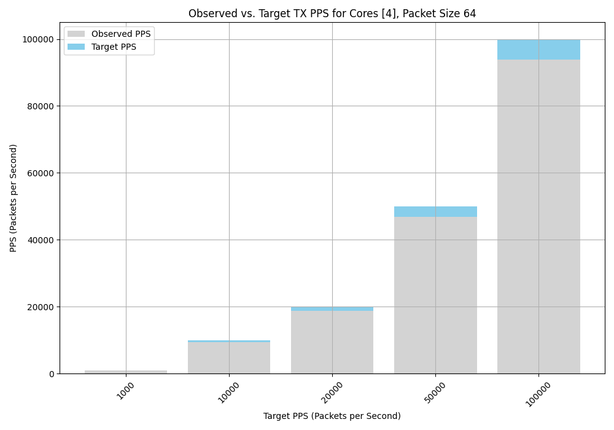
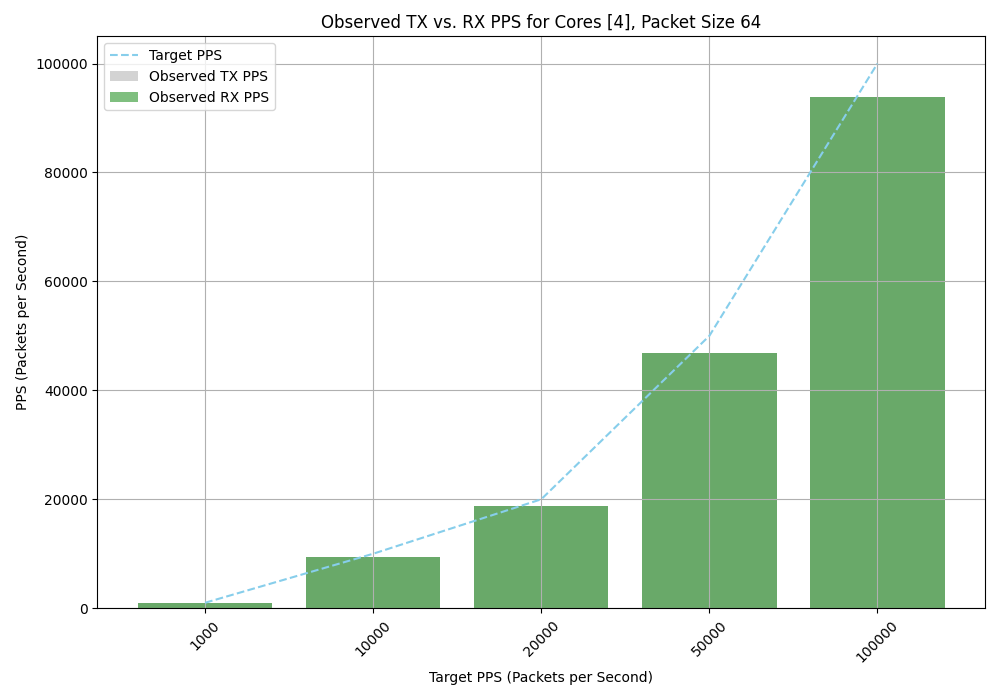
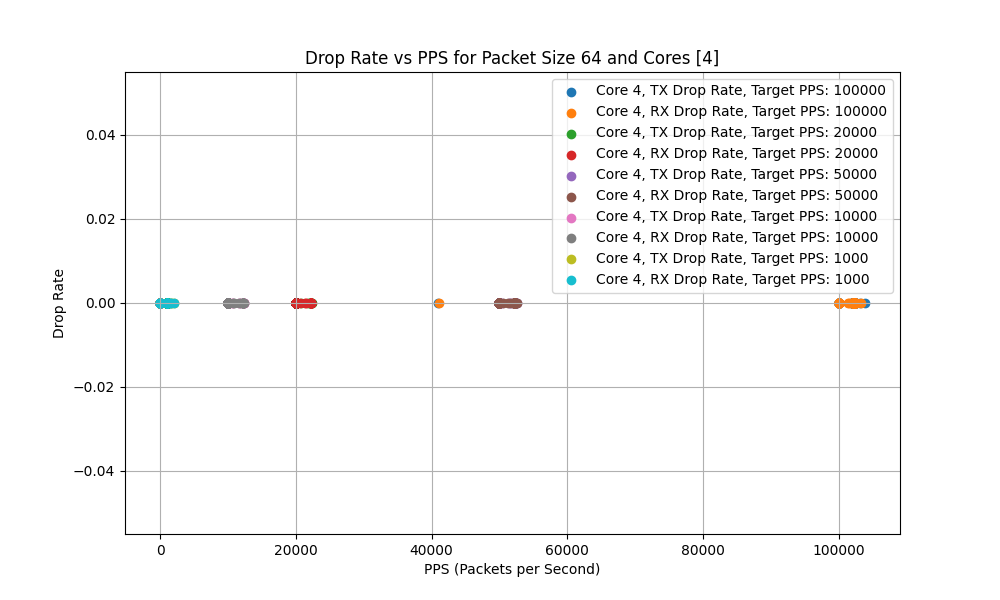
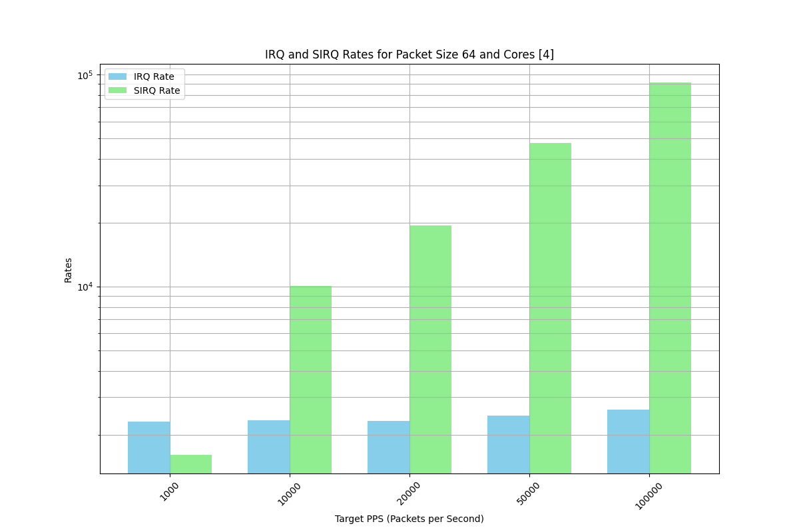

# Benchmarking linux IP stack using trafgen.

## Instruction

This repo hosts a set of bash scripts and inference scripts that I use to benchmark the Linux IP stack. 
This script requires access to kubeconfig, so make sure you update the KUBECONFIG env variable.

Our goal is to validate performance at different packet sizes/packet rates; hence, the set script 
creates N traffic profiles for each POD during the initial phase. Later, each run consumes the same 
profile and pass to trafgen; each run can change core affinity, packet size, packet rate.

All data is collected into separate files and later passed to inference offline mode to 
perform a set of correlations and visualization.

## Usage

First, create pods by running create_pods.sh script. This script will create N server and N client pods. 
Then, run the generate_per_pod.sh script to generate the config for each pod. This script will be 
copied to each pod  pkt_generate_template.sh

pkt_generate_template later executed. What this script does is first resolve the default gateway IP address.
It will perform a single ICMP packet to resolve the ARP cache and arping. It will use the default gateway MAC address
as the dst MAC address on the generated frame.

Each pod is passed the destination IP address, so we have a 1:1 mapping between the server and the 
client. i.e., we have a pair of N server clients for which each server will send traffic to its corresponding client.

- create_pods.sh - create pod executed from compute that has access to kubeconfig.
- generate_per_pod.sh - generate per pod config executed from compute that has access to kubeconfig.
- run_monitor.sh - run monitor script executed from compute that has access to kubeconfig.
- inference.py - inference script executed from compute that has access to kubeconfig.
- pkt_generate_template.sh - executed inside each pod ( called by generate_per_pod.sh)
- monitor_queue_rate.sh - executed inside each worker node ( i.e. script pushed to each worker node)
- monitor_txrx_int.sh - executed inside each worker node ( i.e. script pushed to each worker node)

- pkt_generate_template.sh - pushed to each pod
- monitor_pps.sh - pushed to each pod
- monitor_queue_rate.sh - pushed to each worker node
- monitor_txrx_int.sh - pushed to each worker node

## Purpose

- pkt_generate_template create all udp flow template, it needs access to src mac/dst mac, arp cache to generate right templates.
- monitor_pps.sh - monitor script that will collect data from each pod, so we have viewed on TX / RX , interrupts , IRQ etc.
- monitor_queue_rate.sh - identify TX or RX queue load in balance.
- monitor_txrx_int.sh - identify TX / RX interrupts load and separation and balance.

### Initial setup

```bash
cd src
cp your_kubeconfig .
create_pods.sh
generate_per_pod.sh
```

By default, kubeconfig should be in same spot where all scripts.
- generate_per_pod.sh will create 6 pod (default) 3 TX / 3 RX pod.
- generate_per_pod.sh will create set of profile in tmp dir for 64/128/512/1024 frame size test.
- serverX is sender, clientX is receiver and it 1:1 pair.

4 pair of server-client will be created.

```bash
create_pods.sh -n 4
```

2 pair 2 core per pod 2 GB memory per pod

```bash
create_pods.sh -n 4 -c 2 -m 2
```

Check output 

src/pod-client-template.yaml - template for client pods
src/pod-server-template.yaml - template for server pods
src/pod-client-template-same_node.yaml - template for same worker node 
(Later one in case of bare metal OCP like on single node)

If you run for different cores

```bash
 pip install numpy
 pip install matplotlib
# create_pods.sh
#generate_per_pod.sh
./inferece.py
```

## Running monitor

Default setting will use 1 core, 64 byte frame size profile and 3 pair.  '-m' will tell script to output to stdout
and sample every 1 sec metrics.

```bash
./run_monitor_ssh.sh -p 1000 -m
```

Two core per pod default 3 pair.

```bash
./run_monitor_ssh.sh -p 1000 -m -c 2
```

4 core per pod 4 pair in monitor mode

```bash
./run_monitor_ssh.sh -p 1000 -m -c 2 -n 4
```

4 core per pod 4 pair in collector mode. 
( without -m script will collect on TX and RX pods and write separate files)

```bash
./run_monitor_ssh.sh -p 1000 -c 2 -n 4
```

Generate per pod will output C struct, so you can check that dst mac IP set per pod.
This phase need to be done only once during pod creation.

### Details.

During initial pod creation create pod read pod spec from template and replace 
value that need to be replaced per pod.  Hence, So if you need adjust anything 
adjust template first.


### Monitor mode.

Default mode example for 1000 pps/sec. -m enable monitor mode.  By default run will 
use single core.  i.e we select from numa topology let say we have 4 core 0, 1, 2, 3 script will pick 2.
It will never use 0, 1 in case we have something heavy running on the pod.  

Note this is relevant in case we don't have static pining in kubelet.
(i.e if you do static pining 0,1 will not allocate anyway)


```bash
run_monitor_pps.sh -p 1000 -m
Starting traffic generator with 1000 pps for 120 seconds on cores 4
Starting on pod server0-ve-56377f29-e603-11ee-a122-179ee4765847 core 4 with 1000 pps for 120 sec
Starting monitor pod server0-ve-56377f29-e603-11ee-a122-179ee4765847 core 4 with 120 sec.
TX eth0: 7 pkts/s RX eth0: 2000 pkts/s TX DROP: 0 pkts/s RX DROP: 0 pkts/s IRQ Rate: 1590, SIRQ Rate: 1912 NET_TX_RATE: 0, NET_RX_RATE: 1008 AVG_SIZE: 88
TX eth0: 1 pkts/s RX eth0: 1000 pkts/s TX DROP: 0 pkts/s RX DROP: 0 pkts/s IRQ Rate: 2764, SIRQ Rate: 1711 NET_TX_RATE: 0, NET_RX_RATE: 1032 AVG_SIZE: 88
TX eth0: 1 pkts/s RX eth0: 1000 pkts/s TX DROP: 0 pkts/s RX DROP: 0 pkts/s IRQ Rate: 1823, SIRQ Rate: 1449 NET_TX_RATE: 0, NET_RX_RATE: 1002 AVG_SIZE: 88
TX eth0: 1 pkts/s RX eth0: 1000 pkts/s TX DROP: 0 pkts/s RX DROP: 0 pkts/s IRQ Rate: 3723, SIRQ Rate: 1803 NET_TX_RATE: 0, NET_RX_RATE: 1017 AVG_SIZE: 88
TX eth0: 3 pkts/s RX eth0: 1002 pkts/s TX DROP: 0 pkts/s RX DROP: 0 pkts/s IRQ Rate: 2882, SIRQ Rate: 1545 NET_TX_RATE: 1, NET_RX_RATE: 775 AVG_SIZE: 57
TX eth0: 1 pkts/s RX eth0: 1000 pkts/s TX DROP: 0 pkts/s RX DROP: 0 pkts/s IRQ Rate: 1694, SIRQ Rate: 1213 NET_TX_RATE: 0, NET_RX_RATE: 738 AVG_SIZE: 88
TX eth0: 1 pkts/s RX eth0: 1000 pkts/s TX DROP: 0 pkts/s RX DROP: 0 pkts/s IRQ Rate: 1369, SIRQ Rate: 1094 NET_TX_RATE: 0, NET_RX_RATE: 741 AVG_SIZE: 88
TX eth0: 1 pkts/s RX eth0: 1000 pkts/s TX DROP: 0 pkts/s RX DROP: 0 pkts/s IRQ Rate: 1548, SIRQ Rate: 1133 NET_TX_RATE: 0, NET_RX_RATE: 740 AVG_SIZE: 88
TX eth0: 1 pkts/s RX eth0: 1000 pkts/s TX DROP: 0 pkts/s RX DROP: 0 pkts/s IRQ Rate: 3191, SIRQ Rate: 1500 NET_TX_RATE: 0, NET_RX_RATE: 741 AVG_SIZE: 88
TX eth0: 1 pkts/s RX eth0: 1000 pkts/s TX DROP: 0 pkts/s RX DROP: 0 pkts/s IRQ Rate: 1482, SIRQ Rate: 1461 NET_TX_RATE: 1, NET_RX_RATE: 1045 AVG_SIZE: 88
TX eth0: 1 pkts/s RX eth0: 1000 pkts/s TX DROP: 0 pkts/s RX DROP: 0 pkts/s IRQ Rate: 1425, SIRQ Rate: 1103 NET_TX_RATE: 0, NET_RX_RATE: 742 AVG_SIZE: 88
TX eth0: 1 pkts/s RX eth0: 1000 pkts/s TX DROP: 0 pkts/s RX DROP: 0 pkts/s IRQ Rate: 2121, SIRQ Rate: 1200 NET_TX_RATE: 0, NET_RX_RATE: 744 AVG_SIZE: 88
TX eth0: 1 pkts/s RX eth0: 1000 pkts/s TX DROP: 0 pkts/s RX DROP: 0 pkts/s IRQ Rate: 3422, SIRQ Rate: 1812 NET_TX_RATE: 0, NET_RX_RATE: 1011 AVG_SIZE: 88
```


### Data collection.

in case we want monitor or collect run ./run_monitor_ssh script. 

This script will run trafgen between two target POD. ( by default it use server0 and serve1)
(we want to validate POD to POD communication on same worker node.)

This script takes -p as mandatory argument, it is pps rate in second 
-p 1000 1000 pps per sec. 

same script launch trafgen and collect data on sender and receiver pod.

During data generation if we run in monitor mode it will only show data collected
on receiver.

It does so by executing monitor_pps.sh on receiver pod.

- In collection mode it will run same monitor_pps.sh on sender and receiver pod
and serialize metric as cvs value per sample time.

- All data read from sysfs and collected to separate file.  

Assume we want use default core ( single core per trafgen)

```bash
./run_monitor_ssh.sh -p 1000
./run_monitor_ssh.sh -p 10000
./run_monitor_ssh.sh -p 100000
./run_monitor_ssh.sh -p 1000000
```

This will create 8 files in metric folder.

Example

```bash
    rx_1000000pps_120_core_0_size_64_20240328122409.txt
    rx_100000pps_120_core_0_size_64_20240328120635.txt
    rx_10000pps_120_core_0_size_64_20240328120118.txt
    rx_1000pps_120_core_0-1_size_64_20240328112149.txt
    rx_1000pps_120_core_0_size_64_20240328115617.txt
    rx_1200000pps_120_core_0_size_64_20240328122905.txt
    rx_200000pps_120_core_0_size_64_20240328134551.txt
    tx_1000000pps_120_core_0_size_64_20240328122409.txt
    tx_100000pps_120_core_0_size_64_20240328120635.txt
    tx_10000pps_120_core_0_size_64_20240328120118.txt
    tx_1000pps_120_core_0-1_size_64_20240328112149.txt
    tx_1200000pps_120_core_0_size_64_20240328122905.txt
    tx_200000pps_120_core_0_size_64_20240328134551.txt
```






Later we can run inference.py to read all this file and 
run cross correlation and visualization.


